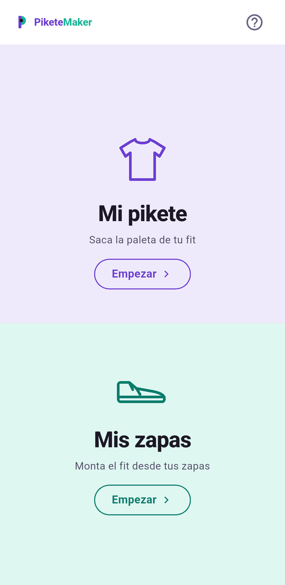
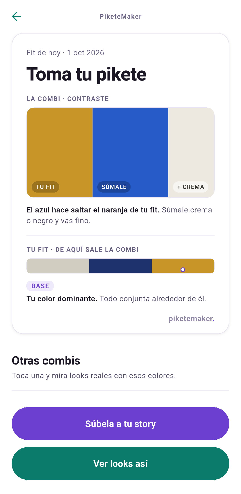
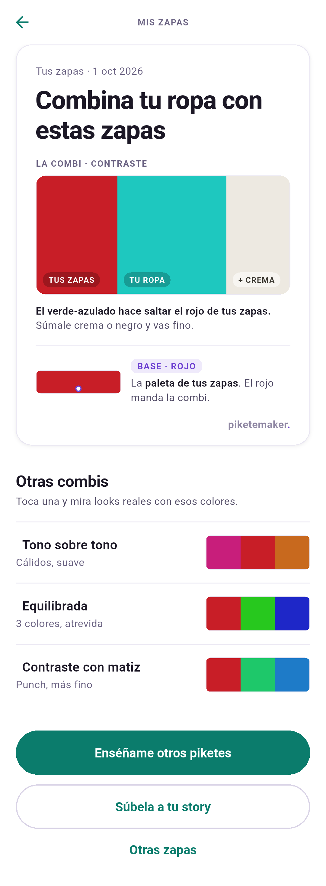
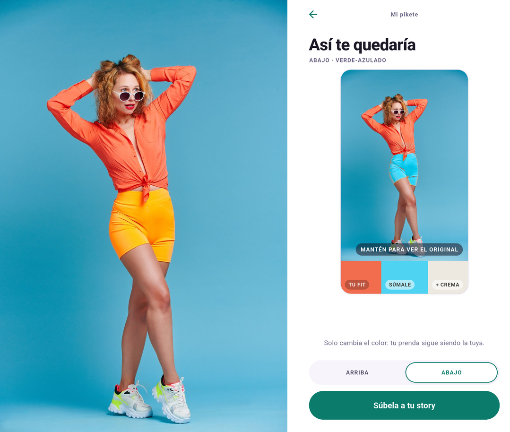
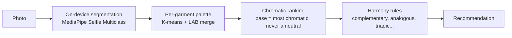

# PiketeMaker

**Take a photo of your outfit (or your sneakers). PiketeMaker segments your
garments on-device, extracts each one's real colour palette, and tells you —
with colour theory, not vibes — what goes with what.**

100% offline. No photo ever leaves the phone. No server in the loop, so the
marginal cost of an analysis is ~0 — that is a product decision, not an
accident. The release build declares **no system permission at all — not even
INTERNET** — and collects no data of any kind: no analytics, no telemetry, no
ads.

<!-- SCREENSHOTS: docs/screenshots/
     01.png = split Home ("Mi pikete" on top, "Mis zapas" below — current order
              since r17; recapture if the file still shows the old order)
     02.png = outfit result, recommendation-first ("Toma tu pikete" hero combo
              band + "Tu fit" ARRIBA/ABAJO strip + "Otras combis")
     03.png = sneaker result (recommendation-first hierarchy)
     04.png = "Vérmelo puesto" before/after: a licensed Pexels stock photo
              (credit in ATTRIBUTION.md) next to the app's recolor screen.
              PUBLIC repo: licensed stock only, never the founder's own photo
              (BACKLOG Q3 privacy rule). -->

| Home | Your outfit, per garment | Sneaker mode |
|---|---|---|
|  |  |  |

| See it on you ("Vérmelo puesto") |
|---|
|  |
| The original photo, then the same photo with only the shorts recolored to the recommended colour, on the phone (stock photo: Vika Glitter / Pexels). |

## How it works



Everything in that diagram runs on the phone. The segmentation model
(MediaPipe Selfie Multiclass, Apache-2.0, Google) separates person, skin,
hair, clothes; the colour engine then works per garment, so your palette is
your *clothes* — not the wall behind you, not your skin, not your hair.

The same garment masks power **"Vérmelo puesto"** ("see it on me"): the app
recolors your top or your bottom *in your own photo* with the colour it
recommends, keeping folds and texture, in about a second on a mid-range phone.
It is a classic LAB colour transform, not generative AI — it changes the colour
of the garment you are already wearing, it does not put a different garment on
you (prints only partly take the colour). So it also runs on the phone, and the
recolored image never touches the disk unless you share it.

Pick another combination under "Otras combis" and the app follows your choice:
the recommendation band, the recolor and the shareable story all switch to it.
"Súbela a tu story" builds a 9:16 image with your photo, the recommendation and
the logo; a preview shows exactly what will be shared ("include my photo" can be
switched off), and the temporary story file is deleted afterwards.

### Architecture at a glance

Two implementations of one algorithm, kept honest by fixtures:

- **`cv_core/`** — Python package `colorlab`: the **canonical** engine. Every
  behaviour is developed here first, validated against real photos, and
  pinned by tests. Ships with a CLI.
- **`app/`** — Flutter app with the engine **reimplemented in Dart**
  (`app/lib/core/color_engine/`) for fully offline on-device inference.
  Parity with the Python reference is enforced by **golden fixtures**: the
  Python side generates them, the Dart suite must reproduce them.

The improvement loop is always: fix in Python (canonical, tested) →
regenerate golden fixtures → Dart re-syncs. Divergence between the two
engines is a failing test, not a code review comment.

## The numbers (measured, not projected)

Quality is gated: a phase closes only when a **gate** passes on a labeled
evaluation set, and every gate review ships in this repo
([`docs/qa/GATE-REVIEWS.md`](docs/qa/GATE-REVIEWS.md), detailed reports in
[`docs/qa/photo-eval/`](docs/qa/photo-eval/)).

| What | Result |
|---|---|
| Sneaker/product mode (gate G2S) | Base-colour accuracy **19% → 73.5%** across the improvement cycle, measured strict (raw palette, no excuses) |
| Per-garment outfit mode (gate G2.5) | Gate passed on an own skin-tone-balanced labeled set; the headline figure is **withheld until re-measured** with the exact configuration the app ships (the battery used a different palette size) — we would rather show no number than a stale one |
| Latency | **544 ms** per analysis on a mid-range Android phone (budget was 3 s) |
| Tests | **1001** across both engines (650 Flutter + 351 Python), incl. security lock tests on the privacy boundary and the release manifest, Python↔Dart golden-fixture parity at real photo size and for the recolor, `flutter analyze` clean, mypy clean |
| Localization | 7 locales, Spanish canonical |

These are first-party measurements on our own labeled sets; the methodology,
raw counts and failure buckets are in the gate reports — read them, they
include the ugly rounds too.

## The method

PiketeMaker is built by a **solo founder orchestrating a team of AI agents**
— UX designer, mobile dev, backend architect, ML engineer, QA engineer,
growth strategist. The role definitions ship in
[`.claude/agents/`](.claude/agents/); the interface between roles is the
artifacts in [`docs/`](docs/) (PRD, design system, ADRs, gate reviews), not
conversation context.

What keeps it honest:

- **Gates, not vibes.** Each phase has a numeric gate on a labeled set,
  signed off with evidence before anything ships.
- **One canonical implementation.** Python decides, Dart mirrors, fixtures
  enforce.
- **Decisions are written down.** The product decision log (D1…D39) lives in
  [`docs/PRD.md`](docs/PRD.md); architecture decisions in
  [`docs/architecture/`](docs/architecture/).

There is a lot of documentation here. [`docs/README.md`](docs/README.md) is a
guided tour: what to read first, which documents are living versus immutable
dated snapshots, and the CV work in narrative order.

## Quickstart

### Python engine (`colorlab` CLI)

```bash
python3 -m venv .venv && source .venv/bin/activate
pip install -e "cv_core[dev]"

# Analyze the bundled synthetic sample — or any photo of yours:
colorlab samples/test_outfit_v3.png -o outputs/out.png

cd cv_core && pytest -m "not slow"   # fast suite, ~10 s
```

Lint and formatting (ruff, config in [`ruff.toml`](ruff.toml) — same gate CI
runs, covering `cv_core/` and `backend/`):

```bash
ruff format --check .   # formatting
ruff check .            # lint
```

The full `pytest` run includes `slow` tests that need the private evaluation
photos; on a clone use the `-m "not slow"` filter above, which is exactly what
CI runs.

### Flutter app

```bash
bash app/tool/fetch_models.sh   # fetches the segmentation model (SHA-256 pinned)
cd app
flutter test                    # engine + parity fixtures + flow tests
flutter build apk --release
```

The model is downloaded once at **build** time; the app itself never
downloads anything at runtime.

## About this repository

> This is the open version of PiketeMaker. The full development history —
> decision log, gate reviews as they happened, issue tracker, growth
> strategy — lives in a private repo; if you're reviewing this project
> (incubator, recruiter, potential partner) and want the detailed process,
> contact the author for access.

Request access via the author's GitHub profile:
[github.com/kahache](https://github.com/kahache). This repo is a curated
snapshot refreshed at milestones — see
[`CONTRIBUTING.md`](CONTRIBUTING.md) for what that means in practice.

## License

Source-available under the **PolyForm Noncommercial License 1.0.0** — read,
study, evaluate, and use it noncommercially; commercial use is not licensed.
See [`LICENSE`](LICENSE).

Third-party attributions (MediaPipe segmentation model, fonts, sample
photos): [`NOTICE`](NOTICE) and [`ATTRIBUTION.md`](ATTRIBUTION.md).
