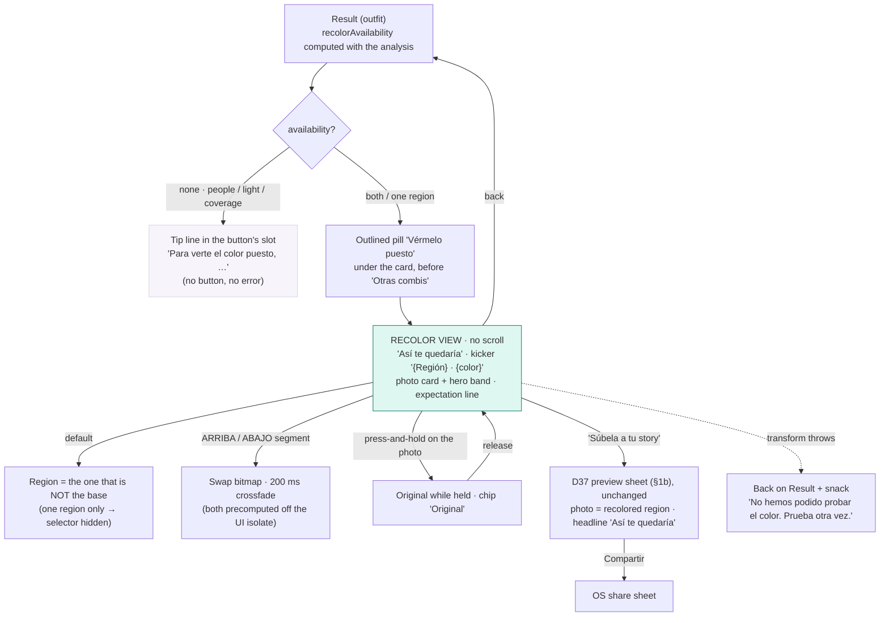

# I2 step 1b: "Vérmelo puesto", per-region recolor of the user's own photo. UX proposal

| | |
|---|---|
| **Owner** | ux-designer |
| **Date** | 2026-09-30 |
| **Phase** | F2 · ICEBOX I2 (amendment 2026-09-30), step 1b of the split (1a = PoC, 2 = canonical Python, 3 = Dart + parity, 4 = visual-quality gate) |
| **Status** | PROPOSAL. 8 recommendations for the CEO to approve/veto one by one (§2, same protocol as D37). No production code, no commit. |
| **Inputs** | CEO GO-with-conditions on the PoC `docs/architecture/2026-09-30_1025_F2_I2-recolor-poc.md` (C1 mask hardening ships with it, C2 one person + decent light, C3 visual gate) · D36 result (`2026-07-23_1620_F2.5_outfit-result-recommendation-first.md`, as shipped in r12+) · D37 story share (`2026-09-29_1830_F2_share-photo-story-proposal.md`, as shipped in r14) |
| **Framing decisions** | D2 (on-device) · D7/D8/D9 (white, mint = action, purple = accent, tinted neutrals) · D21 (v1 masks = top/bottom) · D33 (anonymous telemetry, no ids) · D36 · D37 · Principle 2 (the user's colour is the protagonist) · Principle 3 (the result is a shareable object) |
| **Mockup** | `docs/design/mockups/2026-09-30_I2-recolor.html` (static, 390 px phones: result entry point, not-applicable, recolor view ARRIBA / ABAJO / press-and-hold, story hand-off, option B before/after). Placeholder figure only; no real photo. |
| **Privacy of this doc** | `docs/design/**` is exported to the public repo: no names, no paths outside the repo, no money figures. |

---

## 0. TL;DR

- **One button, one combo, one screen.** "Vérmelo puesto" is an outlined pill directly under the D36 card (outside the shareable area, before "Otras combis"). It always applies the **hero combo**, like the story does. It opens a **no-scroll recolor view**: the recolored photo with the hero band under it (the very object the story shares), a **two-segment ARRIBA / ABAJO selector** and **"Súbela a tu story"** in the thumb zone. **Press-and-hold** on the photo shows the original.
- **The default region is the one that is NOT the base.** "súmale" is the colour to add; the base garment is what you keep.
- **No dead-end screen.** Every "not applicable" reason is known when the result is built (person count, exposure, mask coverage), so the result shows a one-line **tip instead of the button**. The recolor view has no error state of its own.
- **Copy sets expectations in one line, no apology:** "Solo cambia el color: tu prenda sigue siendo la tuya." Headline in the conditional: "Así te quedaría".
- **Sneaker mode: NO for v1** (no garment mask on a product photo, and recolouring the kicks answers a question the user cannot act on).
- **Privacy holds:** the recolored bitmap is memory-only, reaches disk only inside the story PNG the user explicitly shares, and follows the r14 deletion rule. ONB-1's line stays literally true.
- **Telemetry:** four anonymous events + one boolean on the existing `story_exported`. Enums only, never a colour value, never an id.

---

## 1. What is being designed (and what is not)

Scope (CEO, 2026-09-30): recolor **one region at a time** (ARRIBA or ABAJO, the G2.5 masks, D21) of the user's **own uploaded photo** with the colour the recommendation proposes; the other region, skin, hair and background stay as shot. On-device, ~23 ms per region at 512 px in Python (VERIFIED in the PoC), so from the user's side it is instant. v1 = one person, decent light. Prints: only the light stripe takes the colour, the print survives (VERIFIED, panel 02): the UX must say so without apologising.

Out of scope for this proposal: the transform itself, the mask hardening (C1, ml-engineer), the visual-quality gate protocol (C3, qa), sneaker mode (§2.6, recommended out).

---

## 2. The eight design questions, each with a recommendation

### 2.1 Entry point on the D36 result. **Recommendation: one outlined pill "Vérmelo puesto" directly under the card**

Placement: `PkSecondaryButton`, 56 tall, full width (screen margin 20), **12 px under the share canvas and before "Otras combis"**. On an 844 phone it is above the fold; on a 780 phone it sits at the fold edge (the card's bottom edge already invites the scroll).

Why there and not elsewhere:

| Option | Verdict |
|---|---|
| **Under the card (recommended)** | It is the action ON the recommendation, so it lives with the recommendation. Outside the card, because the card is the OFF-state story export and DS §5 forbids chrome inside the shareable area. The bottom block keeps its two pills. |
| Third pill in the bottom CTA block | A wall of three pills, rejected for the same reason D37 rejected it on the sneaker result. |
| A "vérmelo" per row of "Otras combis" | Four entry points instead of one (D7), and the triadic / split-complementary combos add **two** colours, so "which colour goes on the garment" has no obvious answer. |
| Tap on the hero band | No affordance (D7: big and obvious buttons), and the band is inside the export. |

**Which combo is applied: the hero (complementary) only, in v1.** Exactly the rule D37 uses for the story ("the hero combo, even if the user tapped another row"), so screen, recolor and story never drift. Per-combo recolor (following the #82 row selection) is a v1.1 candidate once the two-colour question above is decided; it costs no UI change, only the rule.

**Canvas mode (100% neutral fit, D10):** the button applies the **selected pop** (`selectedAccentIndex`, the existing on-screen tap) or the first pop when none is selected. Neutral source is the chroma-injection regime, VERIFIED credible on plain fabrics (panels 17, 22). Same button, same label.

Brand budget on the result: one more mint tappable (3 in total with "Ver looks así" and "Súbela a tu story"); purple unchanged (BASE badge + watermark).

### 2.2 Region selector. **Recommendation: automatic default + a two-segment ARRIBA / ABAJO control in the thumb zone**

- **Default = the region that is NOT the base.** The hero band says "tu fit" (keep) and "súmale" (add): the natural reading of "add this colour" is "on the other garment". Base from ABAJO → open on ARRIBA, and vice versa.
- **Selector = segmented control, 48 tall, two segments, `label` typography (11/700 uppercase), `surfaceSubtle` track, active segment white with `shadow.sm` and a 1.5 px `action` ring + `action` text.** Reuses `garmentUpperLabel` / `garmentLowerLabel` ("ARRIBA" / "ABAJO"). Placed 12 px above the CTA: one thumb, no reach.
- **Switching is instant**: both regions are computed on entering the view (two bitmaps, off the UI isolate), the swap is a 200 ms crossfade (`motion.base`).
- Rejected: **automatic only** (the CEO's amendment says the user picks, and seeing the other garment is half the fun); **tap on the photo** (no visible affordance without drawing on the photo, and it collides with the press-and-hold gesture of §2.3).
- **One-region cases:** S3 ("TU ROPA", a single garment), a region below the coverage threshold, or the v1 mid-row split cutting a single top in half (PoC panel 04, condition C1: "only offer the region when both garments are present") → the selector is **hidden**, the view opens on the one good region, the kicker names it. We never announce what is missing (the U5 rule of D36).

### 2.3 The recolored view. **Recommendation: no-scroll screen, the story card as the hero, press-and-hold for the original, "Súbela a tu story" as the only CTA**

Layout (390 × 844, all absolute, nothing scrolls):

| Element | Spec |
|---|---|
| App bar | back chevron (`action`) + "Mi pikete" (the outfit flow's bar) |
| Headline | `display` 32/38 "Así te quedaría", top 112. The conditional is deliberate: a preview, not a promise. |
| Kicker | `label` 11/14 `textTertiary`, "{Region} · {colour}" → "Arriba · azul" (rendered uppercase), top 156 |
| Card | **the same object the story shares**: the photo (scaled, never cropped, the D37 rule) + the hero band flush under it (64 tall on screen, 72 on the story). Width follows the photo's aspect inside a 279 × 372 box (3:4 → 279 × 372), centred, `radius.lg`, hairline ring + `shadow.sm`. Top 182. |
| Hold chip | screen-only, bottom-right inside the photo, 24 tall pill, `rgba(28,24,38,.55)` with white `label` text: "Mantén para ver el original" → "Original" while held. **Never in the export.** |
| Expectation line | `caption` 13/18 `textTertiary`, centred, top 652: "Solo cambia el color: tu prenda sigue siendo la tuya." |
| Selector | §2.2, top 704 |
| CTA | `PkPrimaryButton` "Súbela a tu story" (`resultCtaStory`, reused), 56 tall, 24 from the bottom |

**Before/after gesture: press-and-hold** anywhere on the photo shows the original while the finger is down (the "compare" gesture of every photo editor the persona already uses), crossfade both ways. Rejected: a wipe slider (two-handed, fiddly, and with a 23 ms recolor there is nothing to wipe: instant swap is better), side-by-side thumbnails (halves the photo; the before is one hold away).

**Exit = the D37 sheet, untouched.** Tapping "Súbela a tu story" opens the same preview sheet (`StorySharePreviewSheet`): same "Incluir mi foto" switch (remembered), same privacy line, same "Compartir". Two substitutions in the story frame: the photo is the **recolored bitmap** of the active region, and the headline is **"Así te quedaría"** (the view's own headline: zero drift with the screen the user came from, and an honest marker for free). OFF shares the card-only image, where the recolor plays no part. The switch and its screenshot rule are unaffected (outfit only).

**Option B for the CEO (mockup §3, right):** a before/after story (two photos side by side, 194 wide each). It is the viral format I2 names, but it needs a second story layout and shrinks the person (3:4 photo 311 × 415 → 194 × 259). **Recommendation: v1 = single recolored photo** (reuses D37 byte for byte), before/after in v1.1 if people share the single one.

**Loading:** entering the view shows the original photo immediately and crossfades to the recolor when the bitmap is ready (HYPOTHESIS: 50–150 ms per region at 512 px in Dart; at the export size, see §2.7, a few hundred ms). No spinner, no skeleton: same discipline as the D37 sheet.

**Ver looks así** is not repeated on this screen (one screen, one action; back returns to the result where it lives).

### 2.4 Not-applicable states. **Recommendation: a tip line in the button's slot on the result; no error screen**

All gates are computable when the result is built, from data the engine already has or that C1/C2 add: **person count** (the single-instance limit, PoC panel 05), **scene exposure** (mean L* of the person, PoC hypothesis 7, threshold to be set by ml-engineer), **per-region mask reliability** (coverage, hole ratio, connected components: the C1 metrics). So the result screen receives a `recolorAvailability = both | upperOnly | lowerOnly | none(reason)` and:

| Availability | Result screen | Recolor view |
|---|---|---|
| `both` | button | selector, default = non-base region |
| `upperOnly` / `lowerOnly` | button | selector hidden, opens on the good region |
| `none(reason)` | **tip line** in the button's slot, `caption` 13/18 `textTertiary`, centred, min height 44 | never reached |

The tip is one sentence family, three endings, no tech words, no blame, and it teaches the fix:

| Reason | es (canonical) |
|---|---|
| several people | **Para verte el color puesto, sal solo en la foto.** |
| poor light | **Para verte el color puesto, hace falta más luz.** |
| region too small / masks unreliable | **Para verte el color puesto, que se vea tu fit entero.** |

Why a tip and not a hidden button: hiding it silently means nobody learns the feature exists on the day their photo does not qualify; showing a button that leads to a "no" is a dead end. The tip is neither (it is not an error, so it is not in the E-state family).

**Defensive fallback** (the transform throws at runtime): stay on the result and show a snack "No hemos podido probar el color. Prueba otra vez." (mirrors `storyFailedSnack`). No retry loop.

### 2.5 Expectation copy. **Recommendation: "Solo cambia el color: tu prenda sigue siendo la tuya."**

One `caption` line under the card, always visible. It says it is a colour preview (only the colour changes), that no garment was swapped, and, by implication, that a print stays a print (the garment is still yours). No "aproximado", no "puede que", no apology. Together with the conditional headline "Así te quedaría", the framing is honest twice without a disclaimer.

Alternative if the CEO wants it more literal: "Es una prueba de color, no una prenda nueva." (weaker: "prueba" reads as "test").

### 2.6 Sneaker mode. **Recommendation: NO for v1**

1. **No mask.** Sneaker mode runs the core in product mode, without person layers (D24 / I5 addendum 2): there is no garment mask to recolor. The I2 amendment maps 1:1 onto the G2.5 top/bottom masks; a sneaker mask would be new engine work outside that scope.
2. **Wrong question.** The sneaker flow answers "what do I wear with these kicks". Recolouring the kicks toward the combo answers "what if my kicks were another colour", which the user cannot act on (nobody dyes their sneakers; they buy a different pair). Recolouring a garment maps to a real action (wear or buy a top in this colour).
3. **Worst case for the classic transform.** Sneakers are multi-material, multi-colour objects (upper, sole, laces, logos); a hue replacement over them is the "painted" look the PoC flags on knits, on the hero object of that mode.

The sneaker result keeps the D37 CTA stack unchanged. Re-open if I5 (sneaker DB) or I11 ever brings a product mask.

### 2.7 Privacy line and bitmap lifetime. **Recommendation: ONB-1 stays true; the recolored bitmap follows the r14 story-file rule, and lives in memory only until then**

- **The recolored image is still the user's photo**, derived on-device from the picker bytes and the segmentation mask. Nothing leaves the phone, nothing is uploaded (D2). ONB-1 "Tu foto no sale de tu móvil y no la guardamos" and the r14 sheet line "Tu foto solo sale del móvil si tú la compartes." stay **literally true** with these rules:
  1. **Memory only.** The two region bitmaps (`ui.Image` / `Uint8List`) are created when the view opens and **disposed when the view is popped** (or on a memory-pressure callback). Never written to disk by us as such, never cached across analyses, never in `shared_preferences`, never in history (F7 does not exist).
  2. **Disk only inside the story PNG**, and only when the user taps "Compartir": the r14 rule applies unchanged (`piketemaker_story.png` deleted on sheet close and on app start; the share plugin's cache copy deleted on app start).
  3. **Resolution:** recommend computing the recolor once at the **story export photo-box size** (≤ 980 × 1038 px, D37 §8.3), which serves both the on-screen card and the story, so no second render and no second copy. HYPOTHESIS: ~4× the 512 px pixel count → a few hundred ms per region in Dart off the UI isolate, well under D22. If measured too slow on the M33, preview at 512 and re-render only the shared region at export size.
  4. **Boundary lock (#98):** the recolor is a pure function of (photo, mask, target, source) inside the engine module; the ads / telemetry SDK boundary test that already forbids third-party access to the photo must cover the recolored bitmaps too (they are the photo).
- **Legal footnote for the lawyer's open list:** the story now may carry an *edited* image of the user (a colour change on their own clothes, rendered locally, user-initiated). No new data category, no new processing purpose beyond D37's user-initiated share; worth one line in the notice ("puedes compartir una versión con el color cambiado"), not a consent change. HYPOTHESIS, lawyer to confirm.

### 2.8 Telemetry (D33: anonymous cards, counts only, no ids). **Recommendation: four events + one boolean on `story_exported`**

| Event | Payload (enums / bools only) | What it answers |
|---|---|---|
| `recolor_gate` | `availability: both\|upper\|lower\|none`, `reason: people\|light\|coverage\|null` | how often the entry point is even offered (the C2 number; the first thing to look at) |
| `recolor_opened` | `region: upper\|lower` (the default region), `canvas: bool` | funnel: result → view |
| `recolor_region` | `region: upper\|lower` | do people switch, and to which garment |
| `recolor_compared` | none (fired once per view on the first hold) | do people check the original (a proxy for "did it look real") |
| `story_exported` (existing, D37) | **+ `recolored: bool`**, + `recolor_region: upper\|lower\|null` | the value question: is the recolored story shared more than the plain one |

Never in any card: colour values, mask metrics per photo, timings per photo (a 23 ms fingerprint is not an id, but per-photo numbers are not counts either), image data. Telemetry is off during Phase A anyway (D33) and the release has no INTERNET permission, so these are local seams like the rest of `AnalyticsService`.

---

## 3. Copy (es canonical) and ARB keys

New keys, `app_es.arb` first (D18), never hardcoded. en/ca/fr voice suggestions are optional and marked as such; zh/ko/ja by the i18n round.

```json
"recolorCta": "Vérmelo puesto",
"@recolorCta": {
  "description": "I2 result screen: outlined pill under the recommendation card that opens the recolor view (the user's own photo with one garment region repainted in the hero combo colour). The CEO's own words. One line at 390 dp."
},
"recolorHeadline": "Así te quedaría",
"@recolorHeadline": {
  "description": "I2 recolor view: display headline AND the headline of the story shared from that view. Conditional on purpose (a colour preview, not a promise). One line, scaleDown floor 24 px on the story."
},
"recolorKicker": "{region} · {color}",
"@recolorKicker": {
  "description": "I2 recolor view: label-style kicker under the headline. {region} = garmentUpperLabel|garmentLowerLabel (already uppercase), {color} = localized colour name of the applied swatch (color_names.dart). Rendered uppercase by the label style.",
  "placeholders": { "region": {}, "color": {} }
},
"recolorExpectation": "Solo cambia el color: tu prenda sigue siendo la tuya.",
"@recolorExpectation": {
  "description": "I2 recolor view: one caption line under the photo card. Sets expectations (only the colour changes; no garment was swapped; prints stay prints) without apologising. Max 2 lines at 320 dp."
},
"recolorHoldHint": "Mantén para ver el original",
"@recolorHoldHint": {
  "description": "I2 recolor view: screen-only chip on the photo (never exported). Affordance of the press-and-hold compare gesture. Rendered uppercase, label style; keep it short."
},
"recolorHoldActive": "Original",
"@recolorHoldActive": {
  "description": "I2 recolor view: the same chip while the finger is down and the original photo is shown."
},
"recolorTipPeople": "Para verte el color puesto, sal solo en la foto.",
"@recolorTipPeople": {
  "description": "I2 result screen, replaces the recolor button when more than one person is detected. A tip, not an error: no blame, no tech words. Same sentence family as the other two tips."
},
"recolorTipLight": "Para verte el color puesto, hace falta más luz.",
"@recolorTipLight": {
  "description": "I2 result screen, replaces the recolor button when the scene is too dark for a credible recolor."
},
"recolorTipCoverage": "Para verte el color puesto, que se vea tu fit entero.",
"@recolorTipCoverage": {
  "description": "I2 result screen, replaces the recolor button when neither region mask is reliable enough (too small, holes, disconnected). Suggests a full-body photo without saying 'mask'."
},
"recolorFailedSnack": "No hemos podido probar el color. Prueba otra vez.",
"@recolorFailedSnack": {
  "description": "I2 defensive fallback when the recolor transform fails at runtime. Mirrors storyFailedSnack. Stays on the result screen."
},
"recolorPreviewLabel": "Tu foto con el color de la combi",
"@recolorPreviewLabel": {
  "description": "I2 recolor view: accessibility (semantics) label of the recolored photo card. Not visible."
}
```

**Reused unchanged:** `garmentUpperLabel` / `garmentLowerLabel` (selector segments and kicker), `resultCtaStory` ("Súbela a tu story", the view's CTA), `storyIncludePhoto`, `storyPhotoPrivacy`, `storyShareCta`, `storyPreviewLabel`, all hero-band tags, `resultTagAdd` for canvas pops.

**Optional voice suggestions (i18n owner to check):**

| Key | en | ca | fr |
|---|---|---|---|
| `recolorCta` | See it on me | Veure-m'ho posat | Voir sur moi |
| `recolorHeadline` | How it'd look on you | Així et quedaria | Ça donnerait ça |
| `recolorExpectation` | Only the colour changes: it's still your own piece. | Només canvia el color: la peça segueix sent la teva. | Seule la couleur change : c'est toujours ta pièce. |
| `recolorHoldHint` | Hold to see the original | Mantén per veure l'original | Maintiens pour voir l'original |
| `recolorTipPeople` | To see the colour on you, be alone in the photo. | Per veure't el color posat, surt sol a la foto. | Pour voir la couleur sur toi, sois seul sur la photo. |
| `recolorTipLight` | To see the colour on you, you need more light. | Per veure't el color posat, cal més llum. | Pour voir la couleur sur toi, il faut plus de lumière. |
| `recolorTipCoverage` | To see the colour on you, show your whole fit. | Per veure't el color posat, que es vegi tot el fit. | Pour voir la couleur sur toi, montre tout ton fit. |

Width check to add to the N3-style widget matrix: `recolorCta` in a 56-pill at 320 dp (all four fit on one line, Arial Bold proxy ≤ 150 px); the two selector segments at 320 dp (each ≥ 130 px wide, "ARRIBA"/"ABAJO" ≈ 55 px: fine at 1.3× text scale too).

---

## 4. Proposed addition to `user-flows.md` (do not apply yet)

To be inserted as **§1c** after §1b, plus one node on the §1 main flow (`K --> V["'Vérmelo puesto' (I2) → §1c"]`).

```markdown
## 1c. "Vérmelo puesto" (I2, 2026-09-30): recolor one region of your own photo

Outfit result only (not sneaker, v1). Applies the HERO combo colour to ONE
region (ARRIBA or ABAJO) of the user's own photo; everything else stays as
shot. Spec: `2026-09-30_1045_F2_I2-recolor-ux-proposal.md`, mockup
`mockups/2026-09-30_I2-recolor.html`.



- **Nothing is kept.** The two recolored bitmaps live in memory for the
  life of the view and are disposed on pop. They reach disk only inside the
  story PNG the user shares, which follows the §1b deletion rule.
- **Canvas mode:** the button applies the selected pop (or the first one).
- **Sneaker mode:** no recolor in v1 (no garment mask on a product photo).
```

---

## 5. Component inventory delta (for `components.md`, after approval)

| Component | New / changed | States |
|---|---|---|
| `PkSecondaryButton` "Vérmelo puesto" | reuse | normal · pressed · (never disabled: replaced by the tip when not available) |
| **Recolor tip line** | new, `caption` centred in a 44-min slot | three copies (people / light / coverage) |
| **Region segmented control** | new: 48 tall, 2 segments, label style, `surfaceSubtle` track, active = white + `action` ring/text | upper active · lower active · hidden (one region) |
| **Recolored photo card** | new: photo (scaled, never cropped) + `HeroComboBand` 64 flush under; the D37 story card at screen size | loading (original shown, no spinner) · recolored · held (original + chip "Original") |
| **Hold chip** | new, screen-only overlay, `label` on `rgba(28,24,38,.55)` | hint · active |
| `StorySharePreviewSheet` | reuse, parameterised by (photo bitmap, headline) | as D37 |

---

## 6. Risks and escalations

1. **The recolor makes every mask error visible** (PoC §6.1). The UX gates the worst (people, light, coverage) before the tap, but a residual bleed onto a floor or a wall will show. C1 (hardening) and C3 (CEO hand review, yes/no per region) are the real protection; the UX cannot paper over it and does not try. **Escalation:** C3's threshold is still undecided; the "not applicable" gate thresholds (exposure, coverage) need numbers from ml-engineer before step 3.
2. **The story now can carry an edited image of the user.** Framed honestly on the image itself ("Así te quedaría"). One line for the lawyer's list (§2.7). If the CEO prefers the story headline to stay "Toma tu pikete", the honesty marker disappears from the shared image; I would not do that.
3. **Two bitmaps at export size** (§2.7 rule 3) is memory (~4 MB each as RGBA at 980 × 1038) and a few hundred ms on entry. Measure on the M33; the fallback (512 preview, export-size render only on share) is designed in.
4. **Design strain on D36, documented, not changed:** the result gains a third mint tappable. Still within D8 (mint on tappables only). If the CEO finds the result too busy, the alternative is to move "Vérmelo puesto" INTO the bottom block as the primary and demote "Ver looks así" to a text button, which I do not recommend before G2-R says which action people take.
5. **Print garments** look "painted" (only the light stripe changes). The copy sets the expectation; the visual gate decides whether prints are gated out (a chroma-variance threshold on the region, HYPOTHESIS) or shown. Recommend: shown, with the line, and let C3 decide.

---

## 7. Decisions for the CEO (approve / veto per line)

| # | Question | Recommendation |
|---|---|---|
| 1 | Entry point | One outlined pill "Vérmelo puesto" under the D36 card, before "Otras combis"; applies the hero combo only (v1); canvas mode applies the selected pop |
| 2 | Region selector | Default = the non-base region; two-segment ARRIBA / ABAJO control, 48 tall, in the thumb zone; hidden when only one region qualifies |
| 3 | Recolored view | No-scroll screen: "Así te quedaría", the story card (photo + band) as hero, press-and-hold shows the original, single CTA "Súbela a tu story" into the D37 sheet unchanged (photo = recolor, headline = the view's); before/after story = option B for v1.1 |
| 4 | Not-applicable | No error screen: a one-line tip replaces the button on the result ("Para verte el color puesto, sal solo en la foto / hace falta más luz / que se vea tu fit entero"); runtime failure = snack |
| 5 | Expectation copy | "Solo cambia el color: tu prenda sigue siendo la tuya." + conditional headline |
| 6 | Sneaker mode | No in v1 (no mask, wrong question, worst case for the transform) |
| 7 | Privacy | ONB-1 stays true; bitmaps memory-only and disposed on pop; disk only inside the shared story PNG under the r14 deletion rule; one line for the lawyer's list |
| 8 | Telemetry | `recolor_gate`, `recolor_opened`, `recolor_region`, `recolor_compared` + `story_exported.recolored` (enums/bools only, D33) |

**Cost note for BACKLOG §F I2 (PM):** this step consumed a fraction of the L budget (see the handback). Step 3 (Dart + parity + the view + sheet parameterisation + tests) looks like **L** on its own once C1 is in; the view has no new component beyond a segmented control and an overlay chip.
