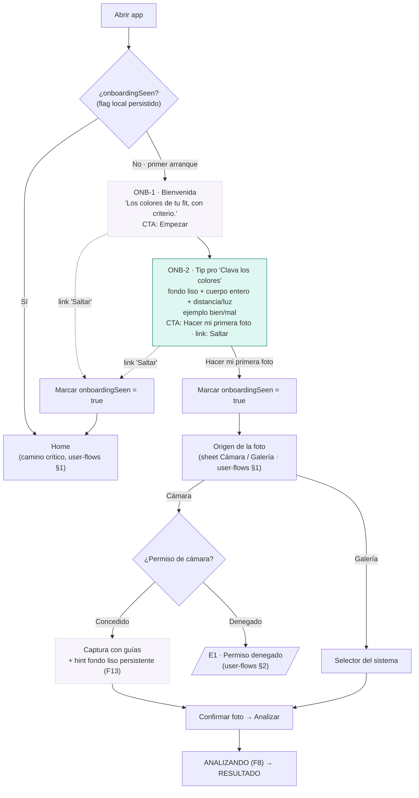

# PiketeMaker — Onboarding first-time (F13)

| | |
|---|---|
| **Owner** | ux-designer |
| **Fecha** | 2026-07-06 |
| **Feature** | F13 (Must) · Tutorial de onboarding first-time |
| **Decisiones marco** | D7+D8+D9 (dirección visual) · D11 (F13 = Must) |
| **Base** | tokens v1.2 · `DESIGN_SYSTEM.md` · encaja en `user-flows.md` (§0) |
| **Estado** | v1 — specs y copy cerrados. **Color de fondo: propuesta UX PENDIENTE de reconciliar con backend** (`docs/architecture/2026-07-06_2217_F0_algo-state-and-tradeoffs.md`) |

---

## 0. El problema que resuelve F13 (y la tensión que gobierna el diseño)

F13 tiene **doble valor** (D11):

- **Activación:** guiar la primera foto reduce fricción y hace que el primer
  resultado sea bueno de verdad → North Star (análisis completados) y objetivo
  de activación (> 60 % completa el 1er análisis en < 2 min).
- **Técnico:** un fondo liso convierte el quitafondo (nuestro mayor cuello de
  botella, B4) en casi trivial → mejores paletas sin depender de segmentación
  avanzada.

**La tensión central del diseño:** los dos valores tiran en sentidos opuestos.

- La activación pide **el menor número de pantallas y que sea saltable** — cada
  pantalla intermedia es fricción y mata el "< 2 min".
- El valor técnico pide que el usuario **vea y aplique** el consejo del fondo
  liso — si lo salta, perdemos el de-risking.

**Cómo la resolvemos (idea rectora):** el consejo del fondo liso **no vive solo
en el tutorial**. Se repite, en versión ligera, como hint persistente en el
overlay de captura (que ya existe en `user-flows.md`). Así el tutorial puede ser
corto y saltable **sin perder el valor técnico**: aunque Dani salte el tutorial,
el consejo reaparece justo cuando encuadra la foto. El tutorial "enseña"; el
overlay "recuerda". Ningún usuario llega a disparar sin haber visto el tip al
menos una vez, en el momento en que importa.

---

## 1. User flow del first-time onboarding

### 1.1 Cuántas pantallas

**Dos pantallas de tutorial**, ni una más (filosofía de minimalismo):

1. **Bienvenida** — qué hace la app, en una frase. Motiva.
2. **Tip pro "Clava los colores"** — la pantalla clave: fondo liso + cuerpo
   entero + distancia/luz, con ejemplo bien/mal. Es donde vive el de-risking.

El **permiso de cámara NO es una pantalla propia del tutorial**: se pide
*contextualmente* al pulsar "Hacer mi primera foto" (la pantalla 2 actúa como
priming natural del permiso). Esto respeta la simplicidad y la buena práctica de
pedir permisos en el punto de uso, no de golpe al arrancar.

> Nota de altura: 2 pantallas es la recomendación. Si el CEO quiere el mínimo
> absoluto, la Bienvenida puede colapsar en la pantalla 2 (1 sola pantalla de
> tutorial). Lo desaconsejo: la Bienvenida es barata (1 tap) y ancla marca y
> propuesta de valor, que importan para retención D7. Decisión del CEO.

### 1.2 Diagrama de flujo



### 1.3 Decisiones del flujo

| Decisión | Resolución | Racional |
|---|---|---|
| **¿Saltable?** | **Sí**, desde ambas pantallas, con "Saltar" en baja jerarquía (`textTertiary`, esquina superior derecha). | No bloqueamos la activación. El valor técnico no se pierde porque el hint del fondo se repite en el overlay de captura. Forzar el tutorial = fricción que mata el "< 2 min". |
| **¿Dónde está el permiso de cámara?** | Contextual, al pulsar "Hacer mi primera foto" en ONB-2. No es pantalla de tutorial. La pantalla 2 hace de priming. | Buena práctica (permiso en punto de uso) + menos pantallas. Si el usuario deniega, cae en **E1** (ya definido en `user-flows.md §2`), que ofrece galería como alternativa. |
| **¿Entrada al camino crítico?** | "Hacer mi primera foto" entra directo al **sheet Origen de la foto** (no al Home). Saltar entra al **Home**. | El usuario que completa el tutorial está caliente: lo llevamos a disparar, no a una pantalla intermedia. El que salta quiere explorar: lo dejamos en Home. |
| **¿Cómo no volver a mostrarlo?** | Flag local `onboardingSeen` (persistido, p.ej. SharedPreferences). Se marca `true` tanto al completar como al saltar. Nunca se vuelve a mostrar. | Estándar y a prueba de reinstalación de sesión. **Nota para mobile-dev:** el flag es puramente de UI; no requiere backend. |
| **¿Re-accesible?** | Sí, opcional y de baja prioridad: entrada "Cómo hacer la foto" en Ajustes. Reusa ONB-2. | Algún usuario querrá revisarlo. No entra en el camino crítico ni compite por atención. Puede posponerse si aprieta el scope de Fase 1. |

**Encaje con `user-flows.md`:** he añadido allí una sección **§0 (Primer
arranque)** que referencia este documento y muestra el gate `onboardingSeen`
como paso previo a "Home", sin duplicar las specs. Ver aviso al final.

---

## 2. Specs de pantalla (low-fi, con tokens reales)

Ambas pantallas usan la **plantilla de onboarding**: viewport 390, margen
lateral `screenMargin` (20), fondo `bg` blanco, CTA primario en zona de pulgar
(`thumbZoneCTA` 24 del borde inferior), un solo `display` por pantalla. Cero
decoración: el aire y la jerarquía hacen el trabajo (minimalismo).

### 2.1 ONB-1 · Bienvenida

```
┌─────────────────────────────── 390 ──┐
│  ●●● 9:41                    Saltar   │  ← statusbar + link Saltar (textTertiary, caption)
│                                       │
│                                       │
│         [ marca / lockup ]            │  ← firma discreta PiketeMaker (kicker/label),
│                                       │     NO ilustración recargada. Mucho aire arriba.
│                                       │
│   Los colores de tu fit,              │  ← display 32/38 · 800 · textPrimary
│   con criterio.                       │     (una sola pieza display)
│                                       │
│   Hazte una foto y te digo tu         │  ← body 15/22 · textSecondary · máx 2 líneas
│   paleta y con qué combina.           │
│                                       │
│                                       │
│              (aire)                   │
│                                       │
│  ┌─────────────────────────────────┐ │
│  │           Empezar               │ │  ← btn-primary · action(mint) · pill · 56px
│  └─────────────────────────────────┘ │
│              ── homebar ──            │
└───────────────────────────────────────┘
```

| Elemento | Token / componente | Notas |
|---|---|---|
| Link "Saltar" | `caption` · `textTertiary` · touch target 44 | Baja jerarquía. Presente pero no invita. |
| Marca/lockup | `label` (kicker) o wordmark pequeño | Firma, no protagonista. Sin gradientes de marca. |
| Titular | `display` · `textPrimary` | Uno solo. Propuesta de valor, no saludo genérico. |
| Subtítulo | `body` · `textSecondary` | Máx 2 líneas. |
| CTA "Empezar" | `btn-primary` (mint ink, texto blanco, pill, 56px) | Único color funcional de la pantalla. |

Uso de marca en esta pantalla: **cero acento morado** (lo reservamos para
donde suma). Mint solo en el CTA. La pantalla vive en blanco + neutros.

### 2.2 ONB-2 · Tip pro "Clava los colores" (pantalla clave)

Es la pantalla que **enseña a hacer bien la foto** y donde vive el de-risking
técnico. Estructura: badge de "tip pro" → titular → comparación bien/mal →
3 puntos → frase de refuerzo → CTA que dispara la cámara.

```
┌─────────────────────────────── 390 ──┐
│  ●●● 9:41                    Saltar   │
│                                       │
│  ┌ TIP PRO ┐                          │  ← badge label · accent(morado) tint+ink
│  └─────────┘                          │     (1ª de las ≤2 dosis de morado)
│  El truco para                        │  ← display 32/38 · textPrimary
│  clavar los colores                   │
│                                       │
│  ┌──────────────┐  ┌──────────────┐   │  ← comparación bien / mal
│  │   ✓  BIEN    │  │   ✕   MAL     │   │     dos tarjetas radius md, border
│  │ [silueta     │  │ [silueta      │   │     Miniaturas ILUSTRADAS (no fotos
│  │  sobre pared │  │  sobre cuarto │   │     reales por ahora): pared lisa vs
│  │  lisa clara] │  │  con lío]     │   │     fondo recargado.
│  │ borde        │  │ borde         │   │     ✓ en success · ✕ en textTertiary
│  │ success sutil│  │ neutro        │   │     (NO en error: no es un error del
│  └──────────────┘  └──────────────┘   │      usuario, es un consejo).
│                                       │
│  ●  Ponte frente a una pared lisa     │  ← 3 filas · icono + body
│     de un solo color.                 │     Punto 1 (fondo) = el hero: primero
│  ●  Que se te vea el fit entero,      │     y con más peso visual.
│     de arriba abajo.                  │     Iconos en action-ink, 1 línea c/u.
│  ●  Un paso atrás y con buena luz.    │
│                                       │
│  Cuanto más liso el fondo, mejor      │  ← caption · textSecondary
│  te leo los colores.                  │     (encuadra el fondo como TIP, no límite)
│                                       │
│  ┌─────────────────────────────────┐ │
│  │      Hacer mi primera foto      │ │  ← btn-primary mint · dispara cámara
│  └─────────────────────────────────┘ │     → sheet origen → permiso contextual
│              ── homebar ──            │
└───────────────────────────────────────┘
```

| Elemento | Token / componente | Notas |
|---|---|---|
| Badge "TIP PRO" | `label` · `accent.tint` fondo + `accent.ink` texto · radius sm | 1 de las ≤ 2 dosis de morado. Firma "consejo de nivel", no advertencia. |
| Titular | `display` · `textPrimary` | Uno solo. |
| Tarjetas bien/mal | `card` radius md · `border` · miniatura ilustrada | Ver §2.3. La de "bien" con borde `success` sutil; la de "mal" con borde neutro y ✕ en `textTertiary`. **Nunca rojo/error** en la mala: no culpamos al usuario. |
| Punto 1 · fondo (hero) | fila icono + `body` · `textPrimary` | El más importante: primero y algo más de peso. Es el que de-risca el algoritmo. |
| Puntos 2 y 3 | fila icono + `body` · `textSecondary` | Cuerpo entero; distancia + luz (fusionados en 1 punto para no pasar de 3). |
| Frase de refuerzo | `caption` · `textSecondary` | Convierte la restricción técnica en beneficio del usuario. |
| CTA | `btn-primary` mint · 56px · pill | Dispara el sheet de origen de foto y, vía cámara, el permiso del sistema. |

Uso de marca: **1 dosis de morado** (badge TIP PRO), mint solo en iconos de los
puntos y el CTA. Sigue sin competir con nada: aquí no hay paleta de usuario aún,
pero mantenemos la disciplina.

### 2.3 El ejemplo bien / mal

- **Formato:** dos miniaturas lado a lado (grid 2 col, gap `md`), cada una en
  card `radius md`.
- **Contenido (Fase 1):** **ilustraciones/siluetas esquemáticas**, no fotos
  reales. Una figura neutra sobre pared lisa clara (BIEN) vs la misma figura
  sobre un cuarto recargado —estantería, cuadros, ropa tirada— (MAL). Siluetas
  planas en neutros del tema; el "acierto" se comunica con el marco y el
  check, no con color chillón (no queremos competir con la futura paleta).
- **Por qué ilustración y no foto:** (a) evita sesgo de cuerpo/piel/estilo en el
  ejemplo (coherente con "no opinamos del cuerpo"); (b) autocontenida, sin
  depender de assets fotográficos con derechos; (c) más legible a tamaño mini.
- **Etiquetas:** "BIEN" / "MAL" en `label`. ✓ en `success`, ✕ en `textTertiary`.

---

## 3. UX writing / copy (español)

Tono: colega con criterio (design system §4). Directo, 2ª persona, frases
cortas. El fondo liso se vende como **truco pro para clavar los colores**, nunca
como limitación técnica nuestra.

### ONB-1 · Bienvenida

| Slot | Copy |
|---|---|
| Titular | **Los colores de tu fit, con criterio.** |
| Subtítulo | Hazte una foto y te digo tu paleta y con qué combina. |
| CTA | **Empezar** |
| Link | Saltar |

### ONB-2 · Tip pro

| Slot | Copy |
|---|---|
| Badge | **TIP PRO** |
| Titular | **El truco para clavar los colores** |
| Etiqueta card buena | BIEN |
| Etiqueta card mala | MAL |
| Punto 1 (fondo, hero) | **Ponte frente a una pared lisa de un solo color.** |
| Punto 2 (encuadre) | Que se te vea el fit entero, de arriba abajo. |
| Punto 3 (distancia/luz) | Un paso atrás y con buena luz. |
| Refuerzo | Cuanto más liso el fondo, mejor te leo los colores. |
| CTA | **Hacer mi primera foto** |
| Link | Saltar |

### Comparativa de tono (por qué así)

1. **El tip del fondo:**
   - ✅ "Ponte frente a una pared lisa de un solo color." (acción, tuya, fácil)
   - ❌ "El sistema necesita un fondo uniforme para segmentar correctamente."
     (jerga, culpa a la máquina, suena a limitación)
2. **El refuerzo:**
   - ✅ "Cuanto más liso el fondo, mejor te leo los colores." (beneficio para ti)
   - ❌ "Los fondos con textura reducen la precisión del análisis." (paper)
3. **El CTA:**
   - ✅ "Hacer mi primera foto" (verbo del usuario, primera vez, ilusión)
   - ❌ "Continuar" / "Abrir cámara" (frío, de wizard genérico)

### Hint persistente en captura (F13 en el overlay, no bloqueante)

Una línea corta en el overlay de captura (ya existe "cuerpo entero, buena luz";
añadimos el fondo). Es la red de seguridad para quien saltó el tutorial:

- ✅ "Fondo liso = colores más finos." (recordatorio, no orden)
- ❌ "Recuerde colocarse frente a un fondo uniforme." (regañina)

---

## 4. Recomendación de color de fondo (óptica UX/marca) — **PENDIENTE RECONCILIAR CON BACKEND**

> ⚠️ **Decisión compartida.** El color de fondo óptimo es a la vez un parámetro
> de algoritmo (lo estudia backend en `docs/architecture/2026-07-06_2217_F0_algo-state-and-tradeoffs.md`)
> y un mensaje de producto (lo redacto yo). Lo de abajo es **mi propuesta desde
> criterio de diseño; NO está cerrada** hasta reconciliarla con el reporte
> técnico. Donde UX y algoritmo choquen, gana la conversación conjunta, no este
> documento.

### 4.1 Criterios de diseño

Un buen color de fondo, desde UX/marca, debe cumplir:

1. **Disponibilidad real (el criterio #1 para activación).** El fondo que
   recomendamos tiene que existir en casa de Dani. Si pedimos "una pared azul
   klein" o "un croma verde", la activación muere: casi nadie lo tiene. La
   mayoría sí tiene **una pared blanca o clara y lisa**.
2. **No teñir la ropa (color cast).** Una pared muy saturada rebota color sobre
   la ropa y la piel → falsea la paleta extraída, que es justo nuestro producto.
   Los neutros no tiñen.
3. **Contraste con outfits variados.** El streetwear de Dani va de negro total a
   colores flúor. Ningún color contrasta *con todo*. La propiedad que sí ayuda
   siempre es la **uniformidad**, no el matiz → el mensaje debe priorizar
   "liso y de un solo color" por encima de "de tal color".
4. **No colisionar con la marca.** Mint/morado son nuestros. No pedimos un fondo
   mint/morado: confundiría el objeto compartible con nuestra identidad y añade
   color cast de un tono que "es nuestro".
5. **No competir con la futura paleta.** Cuanto más neutro el fondo, más vibra
   el outfit (mismo principio que el blanco de la UI).

### 4.2 Propuesta UX (lean, no cerrada)

- **Mensaje primario = uniformidad:** "una pared **lisa de un solo color**".
  Es lo que más ayuda al algoritmo y lo más fácil de cumplir. Lo ponemos como
  punto hero del tutorial.
- **Matiz recomendado = claro y neutro** (pared blanca / hueso / gris claro).
  Por disponibilidad (#1), cero color cast (#2) y no colisión de marca (#4).

### 4.3 La tensión que backend debe resolver (y por eso NO cierro el matiz)

- Un fondo **blanco** falla con prendas **blancas** (blanco-sobre-blanco: el
  quitafondo no puede separarlas). Buena parte del streetwear tiene blanco.
- Un fondo **gris medio neutro** podría ser mejor "todoterreno" para el
  algoritmo (contrasta razonablemente con blanco *y* con negro), pero es
  **menos disponible** que una pared blanca → peor para activación.
- Un **croma verde/azul** sería lo ideal para keying clásico, pero es
  **inviable en UX** (nadie lo tiene, tiñe piel, colisiona visualmente).

**Mi recomendación operativa a falta de reconciliar:** vender **uniformidad +
claro-neutro** en el copy (cubre al 80 % de usuarios con su pared de casa), y
que backend confirme si su óptimo es "claro" o "gris medio". Si backend dice
gris medio, ajusto una sola palabra del copy ("lisa y clara" → "lisa, mejor
gris o tono medio") sin rediseñar nada. **El copy está construido para absorber
esa decisión con un cambio mínimo.**

> **Acción para el PM/CEO:** cerrar el matiz de fondo como decisión conjunta
> ux ↔ backend antes de mockup hi-fi y antes de que mobile-dev fije el copy
> del overlay. Hasta entonces, el matiz en este doc es provisional.

---

## 5. Cómo degrada si el usuario ignora el consejo

No podemos (ni queremos) **obligar** a un fondo liso: sería fricción y muchos
harán la foto donde estén. La degradación se diseña para que un mal fondo no
rompa la confianza ni la marca.

### Principios de la degradación

1. **Nunca bloquear por el fondo.** Siempre se puede analizar. No detectamos ni
   vetamos fondos: no hay muro.
2. **Fijar la expectativa correcta *antes*.** Como el tip enmarca el fondo liso
   como "para clavar los colores", si el usuario lo ignora y saca una paleta
   regular, el modelo mental es *"ah, mi fondo tenía lío"* y no *"la app
   falla"*. El copy del tip hace de vacuna.
3. **Recordatorio en el momento, no reproche.** El hint del overlay de captura
   ("Fondo liso = colores más finos") reaparece cada vez: aprendizaje por
   repetición suave, sin regañar.
4. **Si el resultado sale de baja confianza**, reutilizamos el estado **E4**
   (`user-flows.md §2`, "Aquí no vemos un outfit claro") — que ya nudge-a
   "fondo tranquilo" — y añadimos como **CTA secundario** una salida orientada:
   "Repetir con fondo liso". No inventamos pantalla nueva: E4 ya es la casa de
   este caso.
5. **Si el resultado sale, pero mediocre (hay paleta pero sucia):** entregamos
   el resultado (no escondemos valor) y, sólo entonces, un hint inline discreto,
   una vez, no cada análisis:
   - ✅ "¿Colores un poco sucios? La próxima, una pared lisa y clavo mejor."
   - ❌ "El fondo no era adecuado. Repita la foto." (reproche + orden)

### Expectativa que fijamos (resumen)

> "Con cualquier foto te doy una paleta. Con un fondo liso, te la clavo."

Positivo, honesto, sin promesas que el algoritmo no puede cumplir con un fondo
cualquiera. El tip es un *upgrade* opcional, no una condición de entrada.

---

## 6. Componentes nuevos que introduce F13 (para `components.md`)

Aún no existe `components.md`; cuando se cree, F13 aporta estos, todos derivados
del sistema (nada nuevo de estilo):

| Componente | Variantes / estados | Notas |
|---|---|---|
| `OnboardingScaffold` | — | Plantilla: statusbar + link Saltar + contenido + CTA en zona de pulgar. Reutilizable por ONB-1/ONB-2 y por la entrada de Ajustes. |
| `SkipLink` | normal, pressed | `caption`/`textTertiary`, touch target 44. |
| `TipPoint` (fila icono+texto) | hero (textPrimary), normal (textSecondary) | Icono en `action.ink`. |
| `GoodBadExample` | par bien/mal | Card `md` + miniatura ilustrada + etiqueta + check/cross. Estado único (estático). |
| `CaptureHint` (overlay) | visible, oculto | Línea de refuerzo del fondo liso sobre la cámara. Extiende el overlay de captura ya previsto. |

El `btn-primary`, `badge` (label), `card` y tokens son los existentes.

---

## 7. Riesgos UX

| Riesgo | Sev. | Mitigación en este diseño |
|---|---|---|
| El tutorial añade fricción y baja la activación (< 2 min) | Alto | Solo 2 pantallas, saltable, y "Hacer mi primera foto" entra directo a disparar. |
| El usuario salta y perdemos el de-risking técnico | Alto | El hint del fondo se repite en el overlay de captura: el valor no depende de completar el tutorial. |
| El fondo liso se percibe como limitación de la app ("es que si no, no funciona") | Medio | Copy lo vende como truco pro para *tu* beneficio, no como requisito. Degradación sin bloqueo. |
| Recomendar blanco falla con prendas blancas → paletas malas justo en un caso común | **Alto** | **Abierto**: depende del matiz que cierre backend (§4). Es la razón de no cerrar el color aún. |
| El ejemplo bien/mal introduce sesgo de cuerpo/piel | Medio | Siluetas ilustradas neutras, no fotos reales. |
| Mockup hi-fi hecho antes de cerrar el color de fondo = retrabajo | Medio | **No** produzco mockup HTML hi-fi hasta reconciliar §4 con backend. Estas specs low-fi bastan para revisar el flujo. |

---

## 8. Qué necesito del CEO / PM

1. **Aprobar el nº de pantallas:** 2 (recomendado) vs 1 (mínimo absoluto).
2. **Aprobar "saltable = sí"** con el fondo repetido en el overlay como red.
3. **Cerrar el color de fondo (§4) como decisión conjunta ux ↔ backend.** Es lo
   único bloqueante para pasar a mockup hi-fi y para que mobile-dev fije el copy
   del overlay.
4. **Decidir si la entrada re-accesible en Ajustes** entra en Fase 1 o se pospone.
