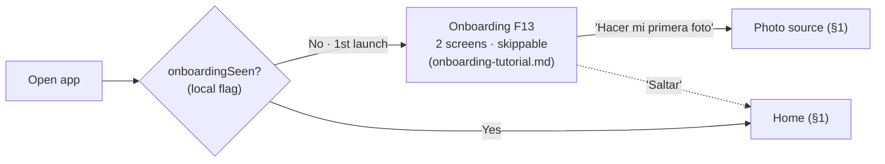
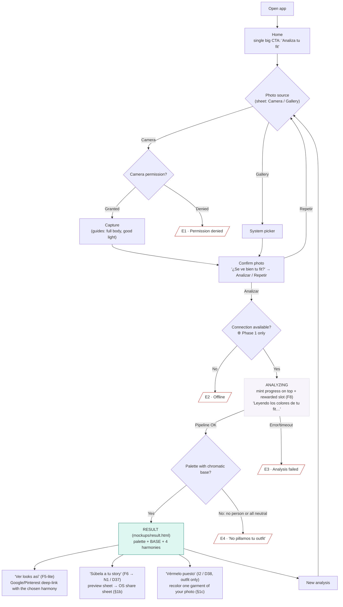
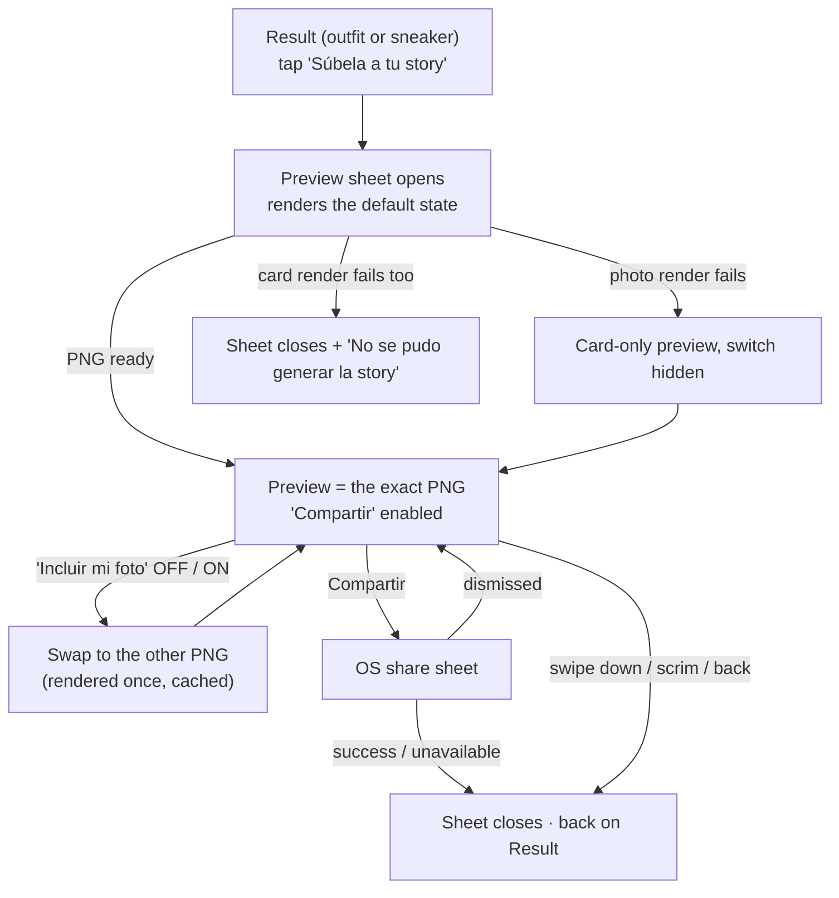
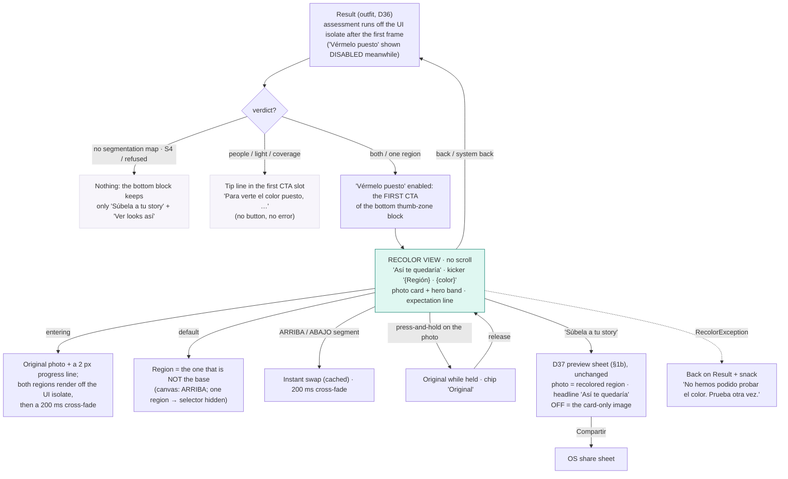
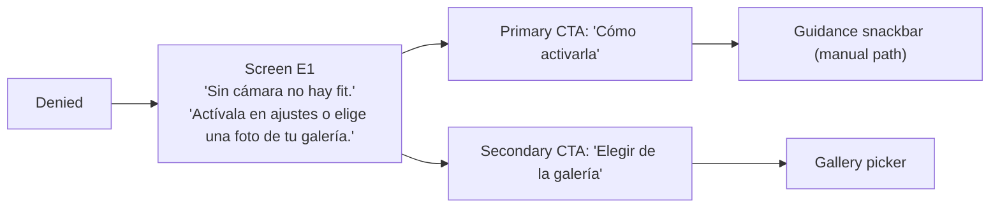
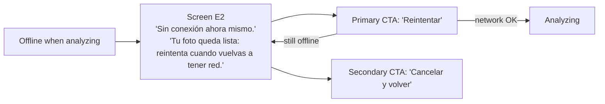
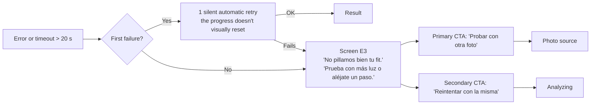
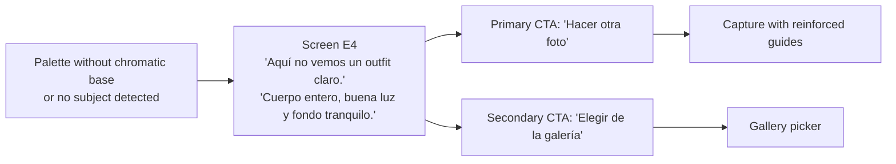

# PiketeMaker — User flows v1 (Phase 1 critical path)

| | |
|---|---|
| **Owner** | ux-designer |
| **Date** | 2026-07-06 |
| **Basis** | D7+D8+D9 closed · tokens v1.2 · canonical mockup `mockups/result.html` |
| **Scope** | Phase 1 MVP (Flutter app + local backend). States marked 🌐 disappear or change in Phase 2 (on-device) |

Principles governing all flows (quoted UI strings are the app's Spanish copy):

1. **Never a dead end.** Every ugly state offers at least one actionable
   exit with a big CTA (and an alternative when one exists).
2. **Errors never blame the user, nor the machine with jargon.** Microcopy
   per design system §4: short, useful, in their language.
3. **The wait is monetization (F8), not a toll.** The rewarded ad only lives
   inside the "analyzing" state and the progress always stays visible.
4. **Perceived speed.** From the "Analizar" tap to the result: p95 < 10 s
   (gate G1). Every intermediate screen must justify its existence.

---

## 0. Before the critical path: first launch (F13)

On the **first launch** the app routes through the first-time onboarding (F13,
Must) before Home. Full specs, copy and decisions in
`docs/design/onboarding-tutorial.md`; here only the entry gate so the
critical path fits without duplication.

- The `onboardingSeen` flag is set to `true` on completion **or** on skip: the
  onboarding never repeats. It's a UI flag, no backend.
- The plain-background tip (F13) is **repeated** as a hint in the overlay of
  the "Capture with guides" screen in §1: even if the user skips the
  onboarding, the tip reappears at framing time. See onboarding-tutorial.md §0.

---

## 1. Main flow (critical path)

Happy-path design notes:

- **Home = one decision.** A single display CTA. History (F7) and settings
  are secondary and live outside the thumb's path.
- **Confirm photo** exists because the cost of a bad analysis (wait + ad)
  is higher than that of one extra tap. It's the last cheap exit.
- **Analyzing:** the progress (mint, non-textual) ALWAYS above the ad.
  If the analysis finishes before the user closes the rewarded ad, the
  result waits behind — on close, reveal with `motion.reveal`.
  The result is never lost because of the ad.
- **Result:** the harmony choice (tap on a row) is what parameterizes the
  "Ver looks así" deep-link.

## 1b. Sharing the story (N1 / D37, 2026-09-29) — outfit AND sneaker results

"Súbela a tu story" no longer jumps straight to the OS share sheet: it opens
a **preview sheet** first. Spec:
`2026-09-29_1830_F2_share-photo-story-proposal.md` (§3), mockup
`mockups/2026-09-29_1830_F2_share-photo-story.html`.

- **What is shared.** Switch ON (default): the user's **whole uploaded photo**
  with the recommendation band glued under it, the headline above and the
  full-colour logo below. Switch OFF: the result card (r13's image). The
  sheet shows the exact PNG that goes out; "Compartir" stays disabled until
  it exists.
- **The switch** ("Incluir mi foto") is remembered locally (one bool, both
  modes). Exception: a sneaker photo from **"Captura de pantalla"** (a shop's
  image) always opens OFF and the choice is not remembered.
- **Both results have the CTA.** Outfit: unchanged ("Ver looks así" pill +
  "Súbela a tu story" secondary pill). **Sneaker** (supersedes D27 for sharing
  only): "Enséñame otros piketes" pill → **"Súbela a tu story"** secondary
  pill → **"Otras zapas"** as a text button under it (still in the thumb
  zone for "scan the next pair").
- **Nothing is kept.** The story file is deleted when the sheet closes, and
  both it and the share plugin's copy are deleted on the next app start. The
  photo leaves the phone only through the user's own share.

## 1c. "Vérmelo puesto" (I2 / D38, 2026-09-30): recolor one region of your own photo

**Outfit result only** (never the sneaker result). Paints ONE region (ARRIBA
or ABAJO) of the user's own photo with the colour the result shows — the
hero "súmale" colour, or the selected canvas pop (the first one when none is
selected); skin, hair, the background and the other garment stay as shot.
On-device, no telemetry of any kind. Spec:
`2026-09-30_1045_F2_I2-recolor-ux-proposal.md`, mockup
`mockups/2026-09-30_I2-recolor.html` (both approved; CEO: no telemetry,
outfit only).

- **Entry point (CEO amendment 2026-09-30, on device):** "Vérmelo puesto" is
  the FIRST CTA of the result's bottom thumb-zone block — under the card (the
  approved mockup's position) it sat below the fold and nobody saw it without
  scrolling. Block order, top to bottom: "Vérmelo puesto" · "Súbela a tu
  story" · "Ver looks así". r17 (CEO polish, same day): all three FILLED
  with white text, mint · purple · mint (the purple story CTA is a ratified
  single-use exception to D8). While the assessment runs the first pill is shown
  disabled at full size (nothing jumps); a blocked photo shows the tip in the
  same 56 px slot; a result that is not eligible has only the two other CTAs.
  The dated mockup and proposal stay as approved snapshots.
- **D39 (2026-10-01): the selected combo drives it.** Tapping an "Otras
  combis" row makes it the combo the app acts on: the hero band swaps in place
  (kicker "La combi · {nombre de la combi}"), "Vérmelo puesto" paints its
  "súmale" colour and both story images share it; tapping the row again
  returns to the main combo (no "back" link, no auto-scroll, no extra row).
  For the 3-colour combos the painted colour is the first non-base colour in
  engine order (triadic +120°, split +150°, analogous −30°). Canvas mode keeps
  its pop selection.
- **Tips** (one sentence family): several people → "…sal solo en la foto";
  poor light → "…hace falta más luz"; unreliable mask / region too small →
  "…que se vea tu fit entero". Without a segmentation map (S4 whole-photo
  fallback, flag off, the EXIF/frame guard) nothing is shown: never teach a
  fix the user cannot apply.
- **Nothing is kept.** The recolored bitmaps live in memory for the life of
  the view and are zero-filled and released on back. They reach disk only
  inside the story PNG the user shares, under the §1b deletion rule.

## 2. Ugly states

### E1 · Camera permission denied

*E1 primary relabeled per the ratified #9 audit point (b) (CEO, 2026-07-09):
the CTA promises guidance and delivers guidance. If the `app_settings`
plugin is ever approved, restore "Abrir ajustes" → system settings.*

- We never re-request the permission in a loop (Android blocks it anyway):
  we detect "permanently denied" and go straight to this screen.
- The gallery as an alternative ALWAYS visible: the permission is not a wall.

### E2 · Offline 🌐 (Phase 1 only: the backend runs on the laptop)

- The confirmed photo is not lost: it stays in local memory until retry
  or cancel (ephemeral processing: never uploaded or persisted without
  analyzing).
- **Phase 2 (on-device):** this state disappears from the critical path; it
  only reappears in "Ver looks así" (the deep-links require network — degrade
  the button with an "offline" hint, don't hide it).

> **Amendment (r13, 2026-09-29):** the E2 screen was **removed from the app**
> (`UglyState.noConnection` and its strings deleted). The analysis is 100%
> on-device, so there is no user-facing network path to fail; the "Ver looks
> así" offline case is handled by its own SnackBar. The flow above is kept as
> history.

### E3 · Analysis failed (pipeline error / timeout)

- The first retry is invisible: Dani must never know the pipeline coughed
  if we fix it in 2 s.
- If the user already watched a rewarded ad on the failed attempt, **no
  other ad is shown on the retry** — the wait was already paid for.

> **Amendment (r13, 2026-09-29):** the **silent automatic retry was removed**.
> The on-device engine is deterministic (same bytes, same seed), so a retry can
> only fail the same way and just doubled the wait. Now: **any** failure —
> including unexpected error types and a 30 s engine timeout — lands directly
> on E3, where the manual "Reintentar con la misma" button remains. A failure
> of the segmentation step alone does not reach E3: it degrades silently to the
> whole-photo result (S4).

### E4 · Photo without a person / unreliable palette

Happens when segmentation finds no subject or the palette ends up with no
chromatic base color (D5: the base can never be a neutral).

- **We do not deliver a bad result.** Better an honest empty result than a
  palette of the bathroom wall: sharing is the growth engine (F6) and an
  ugly story is anti-marketing.
- Legitimate "total black" case: if there IS a subject but the outfit is
  genuinely neutral, it's not E4 — the result is shown with the neutral
  palette and harmonies anchor to the warmest/coolest neutral available
  (pipeline behavior with tests; the UI presents it without a chromatic
  BASE badge). Copy pending validation with QA once the Phase 0 photo
  batch includes the case.

## 3. Rewarded ad (F8) distribution across the flow

| Moment | Ad | Rationale |
|---|---|---|
| Analyzing (first attempt) | Yes, if inventory available | The wait covers it |
| Automatic retry (E3) | No | The wait was already paid |
| Manual retry (E3/E2) | No | Punishing the error with another ad = churn |
| No AdMob inventory | Slot shows a capture tip | The layout doesn't jump |

## 4. Screens pending mockups (for full Phase 1)

Already mockuped: **Result** and **Analyzing** (`mockups/result.html`).

In priority order for mobile-dev:

1. **Home** — single CTA "Analiza tu fit" + discreet access to history (F7,
   if it makes the cut) and settings. It's the activation screen (> 60% first
   analysis in < 2 min).
2. **Photo-source sheet** (camera/gallery) — can be the system bottom sheet
   with custom styling.
3. **Capture with guides** — framing overlay (full body) + light hint
   + plain-background hint (F13, safety net for whoever skipped the
   onboarding; see `onboarding-tutorial.md`).
4. **Confirm photo** — photo + 2 CTAs ("Analizar" / "Repetir").
5. **States E1–E4** — share a template: icon/minimal illustration, short
   body headline, primary + secondary CTA (design the template once and
   vary the copy; all four copies are already defined above).
6. **Chosen-harmony sheet** (on tapping a row) — the scheme's colors +
   parameterized "Ver looks así" CTA; it's the step before the F5-lite
   deep-link.
7. **Story preview** (F6) — DONE as the N1 preview sheet (§1b, D37): the
   exact 9:16 PNG + "Incluir mi foto" + "Compartir" → system share sheet.

With 1–5, mobile-dev can build the complete critical-path skeleton and the
G1 gates (flow < 10 s unassisted) are measurable end to end.
